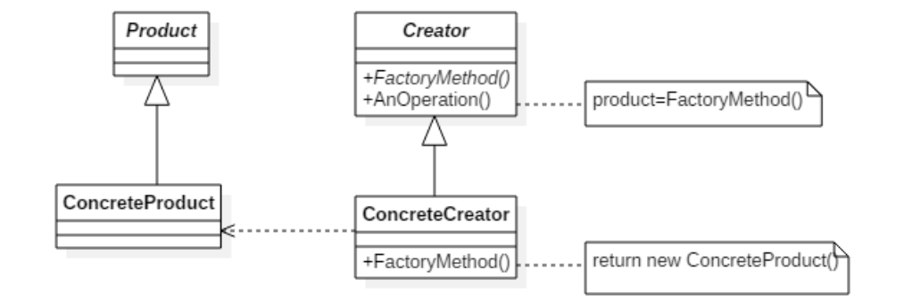
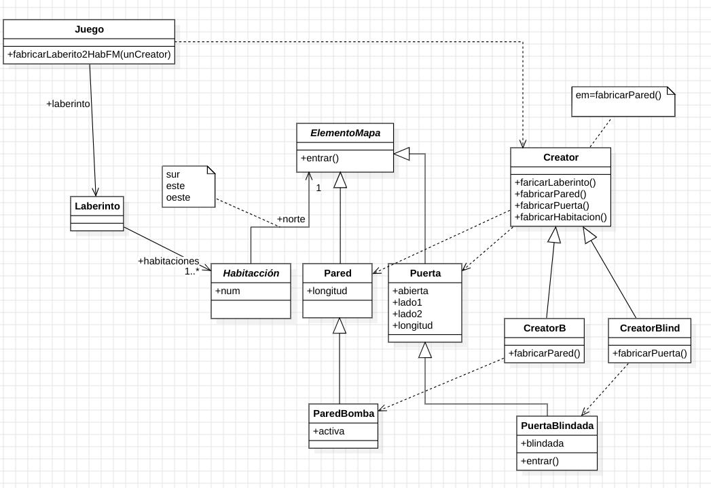
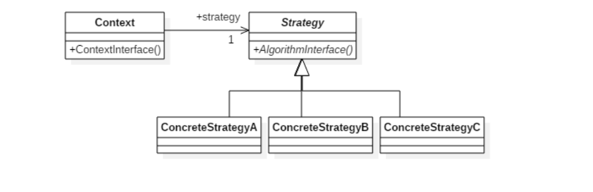
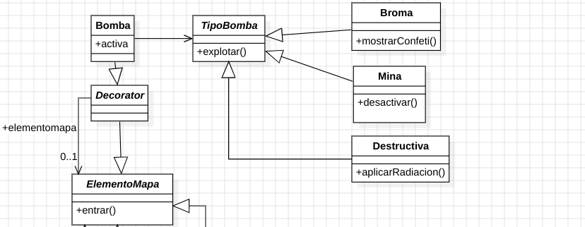
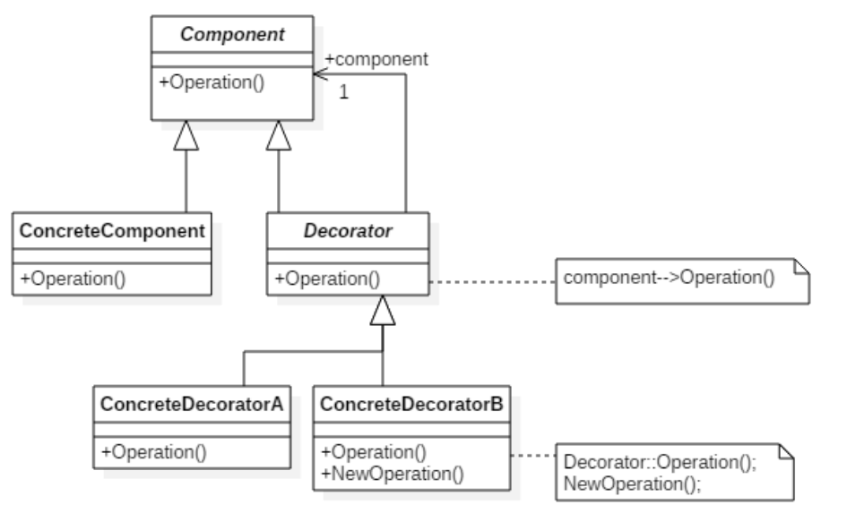
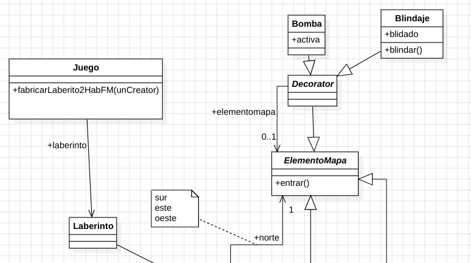
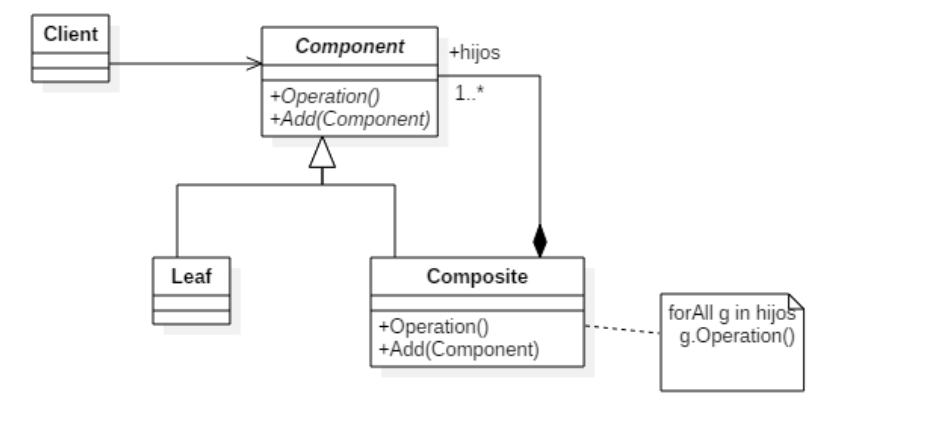
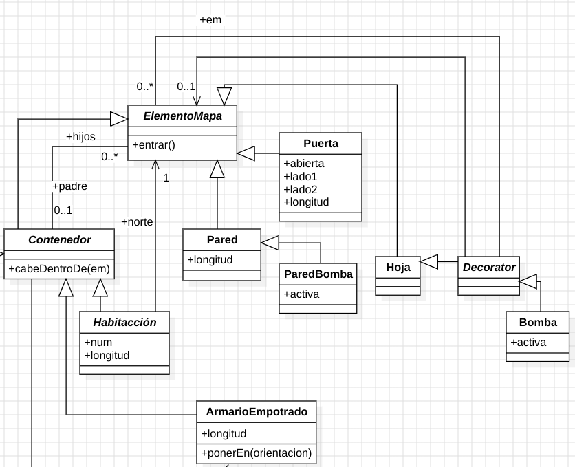
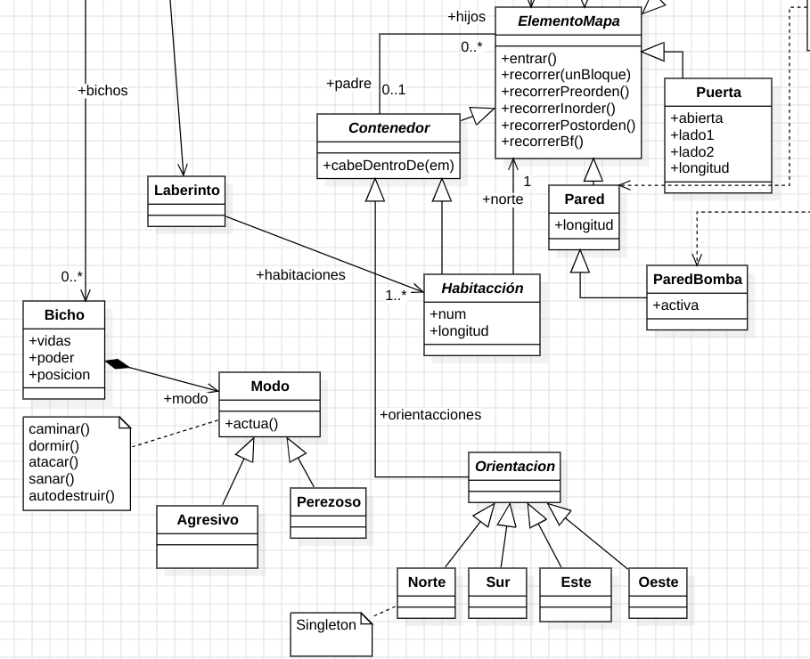

# 📌 Patrones de Diseño

## 📖 Descripción
Este repositorio contiene implementaciones y explicaciones detalladas sobre patrones de diseño fundamentales en la programación orientada a objetos. Cada patrón incluye una descripción clara de su propósito y cuándo debe utilizarse para facilitar su comprensión.

---

## 🔹 Factory Method
### 📌 Propósito
El patrón Factory Method define una interfaz para la creación de objetos, pero permite que las subclases alteren el tipo de objetos que se crean. Facilita la encapsulación de la lógica de instanciación y promueve la reutilización del código.

### 📌 Cuándo Usarlo
- Cuando una clase no puede anticipar el tipo exacto de objetos que debe crear.
- Cuando se desea delegar la creación de objetos a subclases para lograr un diseño más flexible.
- Para simplificar la creación de objetos y evitar la dependencia directa de clases concretas.

### Estructura


### Ejemplo
En nuestro ejemplo nos valemos de un ***creator*** de elementos del mapa y dos ***creator*** concretos, ***CreatorB*** para bombas y ***CreatorBlind*** para blindaje.


---

## 🔹 Strategy
### 📌 Propósito
El patrón Strategy permite definir una familia de algoritmos, encapsular cada uno de ellos y hacerlos intercambiables sin alterar el código cliente. Ayuda a separar la lógica de selección de algoritmos del código principal.

### 📌 Cuándo Usarlo
- Cuando se tienen múltiples maneras de realizar una operación y se quiere cambiar la implementación en tiempo de ejecución.
- Para evitar múltiples condicionales dentro de una misma clase.
- Cuando se desea encapsular la lógica de diferentes estrategias de manera independiente.

### Estructura


### Ejemplo
En el ejemplo se ha implementado para el strategy diferentes tipos de bomba siguiendo la propuesta hecha por el profesor.


---

## 🔹 Decorator
### 📌 Propósito
El patrón Decorator permite agregar funcionalidades adicionales a objetos de manera dinámica sin modificar su estructura original. Es una alternativa flexible a la herencia para extender el comportamiento de los objetos.

### 📌 Cuándo Usarlo
- Cuando se necesita extender funcionalidad sin modificar la clase original.
- Para evitar una jerarquía de herencia demasiado compleja.
- Cuando se desea añadir comportamientos en tiempo de ejecución de manera flexible.

### Estructura


### Ejemplo
En nuestro ejemplo decoramos los elementos del mapa con bomba y blindaje


---

## 🔹 Composite
### 📌 Propósito
El patrón Composite permite tratar objetos individuales y estructuras de objetos de manera uniforme dentro de una jerarquía en forma de árbol. Facilita la gestión de objetos complejos con estructuras recursivas.

### 📌 Cuándo Usarlo
- Cuando se necesita representar una jerarquía de objetos de forma uniforme.
- Cuando se quiere tratar objetos individuales y compuestos de la misma manera.
- Para estructurar elementos en árboles de composición sin afectar su manipulación.

### Estructura


### Ejemplo
En nuestro caso hemos tenemos una clase contenedor del que los elementos mapa que puedan contener a otros pueden heredar, como habitación. También hemos creado el tipo ***ArmarioEmpotrado*** siguiendo la propuesta del profesor. Aquí tenemos ***ElementoMapa(Component)***, ***Composite(Contenedor, Habitación, ArmarioEmpotrado)*** y ***Leaf(Pared, Puerta, etc)***


---


## 🔹 Iterator, Template y Singleton
### 📌 Propósito
- **Iterator**: Proporcionar una forma de acceder secuencialmente a los elementos de un objeto agregado (como una lista, un conjunto, un árbol, etc.) sin exponer su representación interna.

- **Singleton**: Asegurar que una clase tenga una única instancia y proporcionar un punto de acceso global a ella.

- **Template Method**: Definir el esqueleto de un algoritmo en una operación, dejando que las subclases definan
algunos de los pasos.

### 📌 Cuándo Usarlo
- **Iterator**: Cuando hay que acceder al contenido de una colección y soportar múltiples formas de recorrerlo.

- **Singleton**: Cuando debe haber exactamente una instancia de una clase y debe ser accesible a los clientes.

- **Template Method**: Cuanod hay que implementar las partes invariantes de un algoritmo una sola vez y dejar que las
subclases redefinan el comportamiento que puede variar-

### Ejemplo
- **Iterator**: En nuestro caso se puede ver en la implementación de la operación *recorrer(unBloque)*, ***recorrerPreorden(), recorrerInorden(), recorrerPostorden(), recorrerBf()*** sugeridas por el profesor.

- **Singleton**: En nuestro caso lo aplicamos en los objetos Orientación.

- **Template Method**: Tenemos el método actúa que es un Template Method que contiene las partes comunes en la actuación de cada bicho y luego deja que cada tipo de bicho implemente las operaciones primitivas de dormir,caminar y atacar.



## 🚀 Instalación y Uso
1. Clona este repositorio:
   ```bash
   git clone https://github.com/faresuclm/design-patterns.git
   ```
2. Explora los ejemplos dentro de cada patrón.
3. Ejecuta los ejemplos en tu entorno preferido.

---

## 📌 Contribuciones
¡Las contribuciones son bienvenidas! Si deseas agregar mejoras o ejemplos en otros lenguajes, abre un issue o un pull request.

---

## 📝 Licencia
Este proyecto está bajo la licencia MIT. Consulta el archivo `LICENSE` para más detalles.

