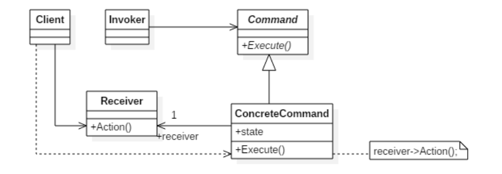
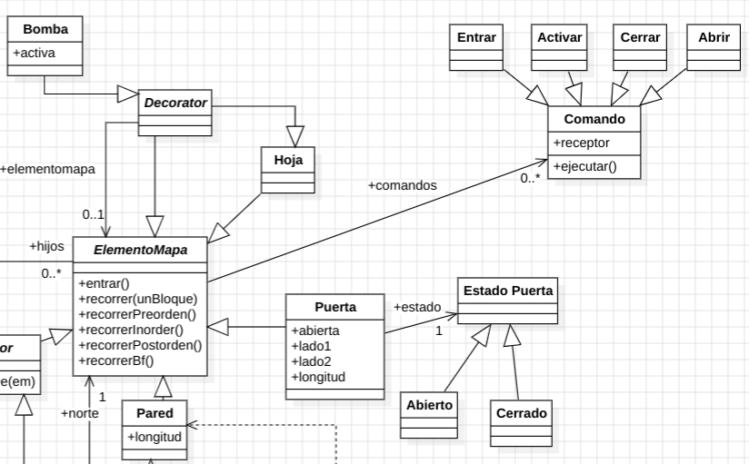

# 📐 Patrones de Diseño en Programación Orientada a Objetos

[](https://opensource.org/licenses/MIT)
[](https://github.com/faresuclm/design-patterns/pulls)
[](https://github.com/faresuclm/design-patterns/commits/main)

---

## 🎯 Resumen

Este repositorio constituye una exploración concisa y práctica de los patrones de diseño esenciales dentro del paradigma de la Programación Orientada a Objetos (POO). Cada patrón se presenta con una definición clara de su propósito, directrices estratégicas para su aplicación y ejemplos concretos que facilitan una comprensión profunda y una implementación efectiva en escenarios del mundo real.

---

## 🧩 Patrones de Diseño Implementados

### 🛠️ Factory Method
**Objetivo:** Define una interfaz para la creación de objetos, delegando la decisión de la clase concreta a las subclases. Este enfoque encapsula la lógica de instanciación, promoviendo un diseño flexible y altamente reutilizable.

**Aplicación Estratégica:**
- Cuando una clase no puede prever el tipo exacto de objetos que necesita instanciar.
- Para permitir que las subclases especifiquen los tipos de objetos a crear.
- Para simplificar la creación de objetos complejos, minimizando el acoplamiento a implementaciones concretas.

**Arquitectura:**


**Implementación Concreta:**
En este proyecto, el patrón Factory Method se ejemplifica mediante la generación dinámica de elementos en un entorno de mapa. Se define un `Creator` abstracto para la creación de elementos, con implementaciones especializadas como `CreatorB` para la instanciación de bombas y `CreatorBlind` para la creación de blindaje.


---

### ⚙️ Strategy
**Objetivo:** Define una familia de algoritmos, los encapsula como objetos y los hace intercambiables en tiempo de ejecución. Esto permite la variación del comportamiento de un objeto independientemente de su tipo.

**Aplicación Estratégica:**
- Cuando existen múltiples algoritmos para una tarea específica y se requiere la capacidad de alternar entre ellos dinámicamente.
- Para mitigar la proliferación de estructuras condicionales complejas (`if-else`) dentro de una clase.
- Para encapsular algoritmos individuales, fomentando su reutilización y mantenibilidad.

**Arquitectura:**


**Implementación Concreta:**
El patrón Strategy se aplica para la implementación de diversos tipos de bombas, cada una con un comportamiento distintivo, siguiendo una arquitectura de diseño adaptable y extensible.


---

### 🔗 Decorator
**Objetivo:** Permite añadir responsabilidades adicionales a un objeto de forma dinámica, sin alterar su estructura fundamental. Ofrece una alternativa flexible y poderosa a la herencia para la extensión de funcionalidades.

**Aplicación Estratégica:**
- Para la adición dinámica y transparente de funcionalidades a objetos individuales.
- Para evitar la creación de jerarquías de herencia profundas y complejas con múltiples subclases.
- Cuando la adición de comportamientos es opcional o debe variar en tiempo de ejecución.

**Arquitectura:**


**Implementación Concreta:**
En este ejemplo, el patrón Decorator se utiliza para enriquecer dinámicamente los elementos del mapa con funcionalidades como "bomba" y "blindaje", extendiendo su comportamiento sin modificar sus clases base.


---

### 🌳 Composite
**Objetivo:** Permite tratar objetos individuales y composiciones de objetos de manera uniforme. Facilita la construcción de estructuras de objetos jerárquicas y la manipulación coherente de sus componentes.

**Aplicación Estratégica:**
- Cuando se necesita representar una estructura jerárquica de objetos con relaciones parte-todo.
- Para permitir que los clientes interactúen con objetos individuales y compuestos de forma indistinta.
- Para simplificar la gestión y manipulación de estructuras de datos complejas.

**Arquitectura:**


**Implementación Concreta:**
Se ha desarrollado una jerarquía donde los elementos del mapa pueden ser tanto componentes atómicos (`Leaf`, como `Pared`, `Puerta`) como contenedores (`Composite`, como `Habitación`, `ArmarioEmpotrado`). La clase abstracta `Contenedor` sirve como base para aquellos elementos capaces de contener otros.


---

### 🔄 Iterator, 🛡️ Singleton y 🏗️ Template Method
**Objetivos Clave:**
- **Iterator:** Proporciona un mecanismo secuencial para acceder a los elementos de una colección sin revelar su organización interna.
- **Singleton:** Garantiza que una clase tenga una única instancia y ofrece un punto de acceso global a ella.
- **Template Method:** Define el esqueleto de un algoritmo en una operación, permitiendo a las subclases refinar ciertos pasos sin alterar la estructura general del algoritmo.

**Aplicaciones Estratégicas:**
- **Iterator:** Cuando se requiere iterar sobre los elementos de una colección de diversas maneras, sin depender de su implementación específica.
- **Singleton:** Cuando es crucial tener exactamente una instancia de una clase para gestionar recursos compartidos o mantener un estado global consistente.
- **Template Method:** Para estandarizar los pasos invariables de un algoritmo, delegando la implementación de los pasos variables a las subclases, promoviendo la reutilización de código y la extensibilidad.

**Implementaciones Concretas:**
- **Iterator:** Se aplica en la implementación de la operación `recorrer(unBloque)`, con métodos especializados para diferentes estrategias de recorrido en estructuras de datos complejas (`recorrerPreorden()`, `recorrerInorden()`, `recorrerPostorden()`, `recorrerBf()`).
- **Singleton:** Se utiliza para la gestión centralizada de las posibles `Orientación` de los elementos del mapa, asegurando una única instancia para cada orientación definida.
- **Template Method:** El método `actúa` define el flujo de control general para la acción de un "bicho" en el juego, mientras que las subclases concretas de "bicho" implementan los detalles específicos de las acciones primitivas como `dormir`, `caminar` y `atacar`.


---

### 🧱 Builder
**Objetivo:** Separa la construcción de un objeto complejo de su representación, de manera que el mismo proceso de construcción puede crear diferentes representaciones.

**Aplicación Estratégica:**
- Cuando el proceso de construcción de un objeto complejo es independiente de las partes que lo componen y de cómo se ensamblan.
- Para simplificar la creación de objetos complejos con múltiples configuraciones posibles, evitando constructores con un gran número de parámetros.

**Arquitectura:**


**Implementación Concreta:**
Se emplea el patrón Builder para la creación de laberintos a partir de la información contenida en un archivo JSON. La clase `Director` coordina el proceso de construcción, utilizando un `Builder` concreto para instanciar las diversas partes del laberinto.


---

### 🚦 State
**Objetivo:** Permite a un objeto alterar su comportamiento cuando su estado interno cambia. Desde el exterior, parecerá que el objeto cambia de clase.

**Aplicación Estratégica:**
- Cuando el comportamiento de un objeto está directamente influenciado por su estado interno y necesita modificarse en tiempo de ejecución.
- Para evitar la proliferación de grandes bloques condicionales que dependen del estado del objeto.

**Arquitectura:**


**Implementación Concreta:**
El patrón State se aplica para definir el comportamiento dinámico de los objetos `Ente` y `Puerta` en función de sus estados definidos en el diagrama. Por ejemplo, una puerta en estado "cerrada" impedirá la entrada, y un ente en estado "muerto" no podrá realizar acciones de ataque.


---

### ✉️ Command
**Objetivo:** Encapsula una solicitud como un objeto, permitiendo parametrizar a los clientes con diferentes solicitudes, encolar o registrar solicitudes, y soportar operaciones de deshacer.

**Aplicación Estratégica:**
- Cuando se desea parametrizar objetos con una acción a ejecutar.
- Cuando se necesita especificar, encolar y ejecutar solicitudes en diferentes momentos.
- Cuando se requiere soporte para operaciones de deshacer/rehacer o para el registro de acciones para auditoría o recuperación.

**Arquitectura:**


**Implementación Concreta:**
En este proyecto, se definen diversos comandos específicos para manipular los elementos del mapa, encapsulando las acciones que se pueden realizar sobre ellos.



---

## 🚀 Puesta en Marcha

1. **Clonación del Repositorio:**
   ```bash
   git clone [https://github.com/faresuclm/design-patterns.git](https://github.com/faresuclm/design-patterns.git)
   cd design-patterns