# ⚙️ Patrones de Diseño en Programación Orientada a Objetos

[](https://opensource.org/licenses/MIT)
[](https://github.com/faresuclm/design-patterns/pulls)
[](https://github.com/faresuclm/design-patterns/commits/main)

## 📖 Descripción General

Este repositorio ofrece una exploración exhaustiva de los patrones de diseño fundamentales en la programación orientada a objetos. Cada patrón se presenta con una descripción concisa de su propósito, directrices claras sobre cuándo aplicarlo y ejemplos prácticos para facilitar una comprensión profunda y su aplicación efectiva.

---

## 💡 Patrones Implementados

### 🔹 Factory Method
**Propósito:** Define una interfaz para crear objetos, delegando la decisión del tipo concreto a las subclases. Esto encapsula la lógica de instanciación y promueve un diseño más flexible y reutilizable.

**Cuándo Utilizar:**
- Cuando una clase no conoce de antemano el tipo exacto de objetos que necesita crear.
- Para permitir que las subclases especifiquen los tipos de objetos a crear.
- Para simplificar la creación de objetos complejos y reducir el acoplamiento a clases concretas.

**Estructura:**
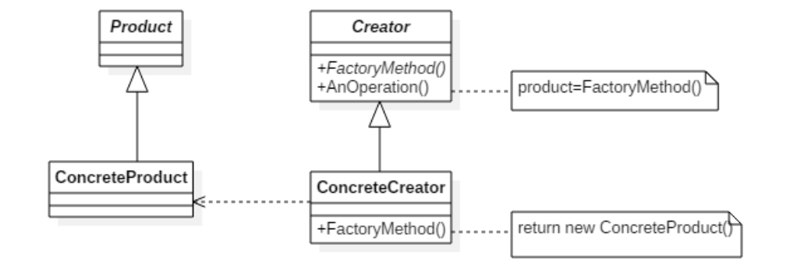

**Ejemplo Práctico:**
En este repositorio, el patrón Factory Method se ilustra mediante la creación dinámica de elementos de un mapa. Se define un `Creator` abstracto para la creación de elementos, con implementaciones concretas como `CreatorB` para generar bombas y `CreatorBlind` para crear blindaje.

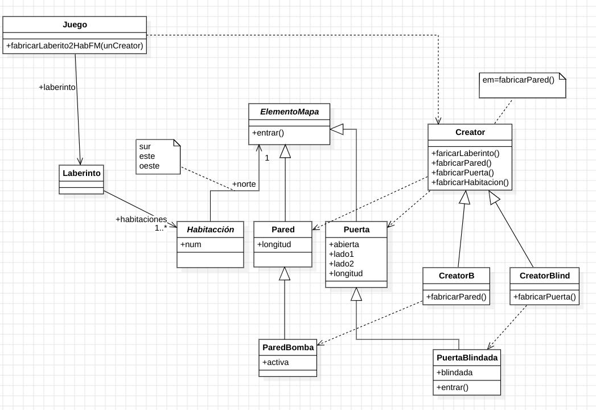

---

### 🔹 Strategy
**Propósito:** Define una familia de algoritmos, los encapsula y los hace intercambiables en tiempo de ejecución. Esto permite variar el comportamiento de un objeto independientemente de su clase.

**Cuándo Utilizar:**
- Cuando existen múltiples algoritmos para una tarea y se necesita cambiar entre ellos dinámicamente.
- Para evitar una gran cantidad de sentencias condicionales (`if-else`) dentro de una clase.
- Para encapsular algoritmos individuales y hacerlos reutilizables.

**Estructura:**
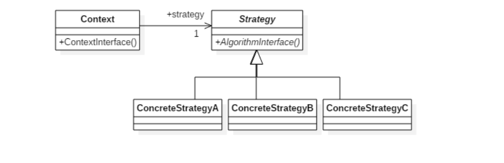

**Ejemplo Práctico:**
El patrón Strategy se aplica para implementar diferentes tipos de bombas, cada una con su propio comportamiento específico, siguiendo una propuesta de diseño flexible y extensible.

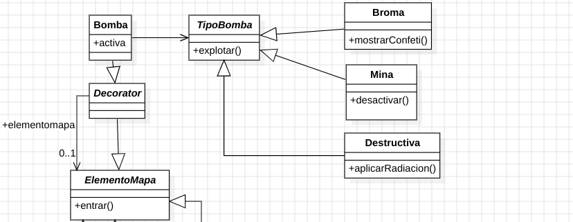

---

### 🔹 Decorator
**Propósito:** Permite añadir responsabilidades a un objeto de forma dinámica, sin necesidad de modificar su estructura. Ofrece una alternativa flexible a la herencia para extender la funcionalidad.

**Cuándo Utilizar:**
- Para añadir funcionalidades a objetos individuales de forma dinámica y transparente.
- Para evitar la creación de una jerarquía de herencia compleja con múltiples subclases.
- Cuando la adición de comportamientos es opcional o puede variar en tiempo de ejecución.

**Estructura:**
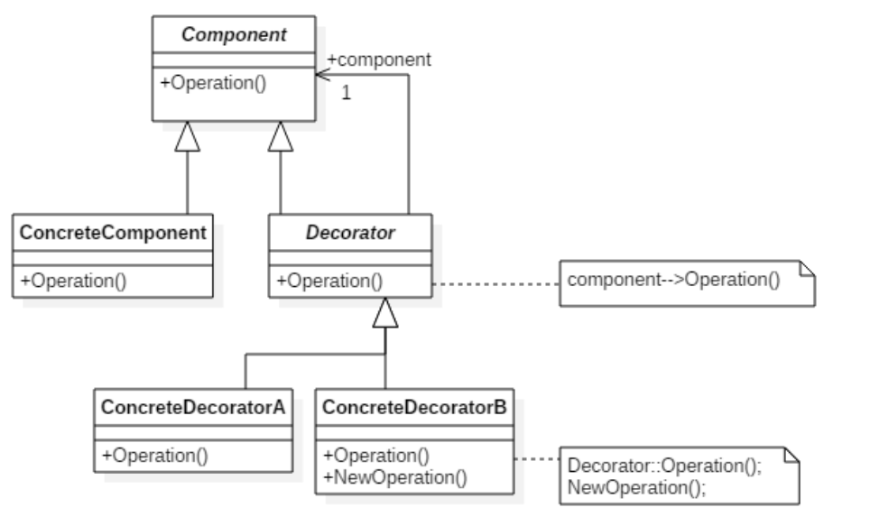

**Ejemplo Práctico:**
En este ejemplo, se utiliza el patrón Decorator para añadir dinámicamente funcionalidades como "bomba" y "blindaje" a los elementos del mapa, extendiendo su comportamiento sin alterar sus clases base.

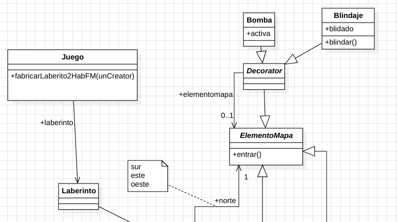

---

### 🔹 Composite
**Propósito:** Permite tratar objetos individuales y composiciones de objetos de manera uniforme. Facilita la creación de estructuras de objetos jerárquicas.

**Cuándo Utilizar:**
- Cuando se necesita representar una jerarquía de objetos parte-todo.
- Para que los clientes puedan tratar objetos individuales y compuestos de la misma manera.
- Para simplificar la manipulación de estructuras complejas.

**Estructura:**
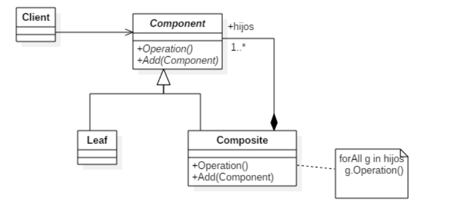

**Ejemplo Práctico:**
Se ha implementado una jerarquía donde los elementos del mapa pueden ser tanto componentes individuales (`Leaf`, como `Pared`, `Puerta`) como contenedores (`Composite`, como `Habitación`, `ArmarioEmpotrado`). La clase `Contenedor` actúa como base para aquellos elementos que pueden contener otros.

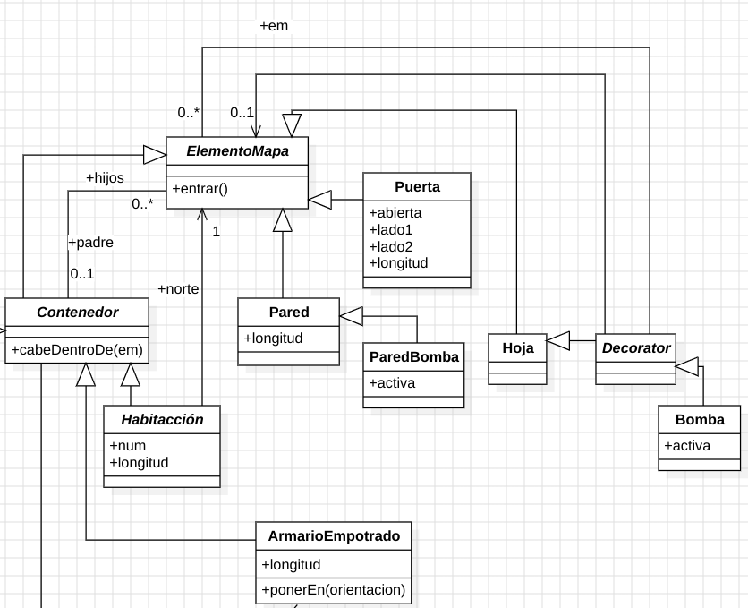

---

### 🔹 Iterator, Template Method y Singleton
**Propósito:**
- **Iterator:** Proporciona una manera secuencial de acceder a los elementos de una colección sin exponer su estructura interna.
- **Singleton:** Asegura que una clase tenga una única instancia y proporciona un punto de acceso global a ella.
- **Template Method:** Define el esqueleto de un algoritmo en una operación, permitiendo a las subclases redefinir ciertos pasos sin cambiar la estructura del algoritmo.

**Cuándo Utilizar:**
- **Iterator:** Cuando se necesita recorrer los elementos de una colección de diversas maneras.
- **Singleton:** Cuando se requiere una única instancia de una clase para gestionar un recurso compartido o un estado global.
- **Template Method:** Para implementar los pasos invariables de un algoritmo una vez y permitir la personalización de los pasos variables por las subclases.

**Ejemplo Práctico:**
- **Iterator:** Se aplica en la implementación de la operación `recorrer(unBloque)`, con métodos específicos para diferentes tipos de recorrido en estructuras de datos complejas (`recorrerPreorden()`, `recorrerInorden()`, `recorrerPostorden()`, `recorrerBf()`).
- **Singleton:** Se utiliza para gestionar las posibles `Orientación` de los elementos del mapa, asegurando una única instancia para cada orientación.
- **Template Method:** El método `actúa` define el flujo general de la acción de un "bicho" en el juego, mientras que las subclases de "bicho" implementan los detalles específicos de las acciones primitivas como `dormir`, `caminar` y `atacar`.

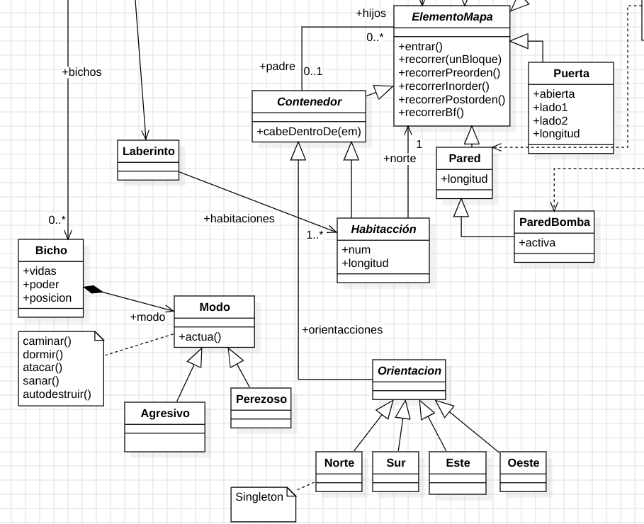

---

### 🔹 Builder
**Propósito:** Separa la construcción de un objeto complejo de su representación, permitiendo que el mismo proceso de construcción cree diferentes representaciones.

**Cuándo Utilizar:**
- Cuando el proceso de construcción de un objeto complejo es independiente de las partes que lo componen y de cómo se ensamblan.
- Para simplificar la creación de objetos complejos con múltiples configuraciones posibles.

**Estructura:**
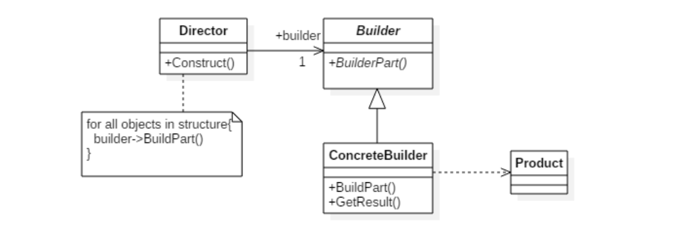

**Ejemplo Práctico:**
Se utiliza el patrón Builder para la creación de laberintos a partir de la información contenida en un archivo JSON. La clase `Director` orquesta el proceso de construcción, utilizando un `Builder` concreto para crear las diferentes partes del laberinto.

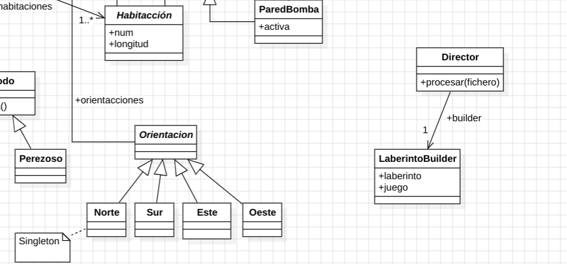


### 🔹 State
**Propósito:** Permite a un objeto alterar su comportamiento cuando cambia su estado interno. El objeto
parecerá cambiar de clase.

**Cuándo Utilizar:**
- Cuando el comportamiento de un objeto depende de su estado y debe cambiar en tiempo de ejecución.
- Cuando tenemos operaciones con muchas sentencias condicionales que dependen del estado del objeto.

**Estructura:**         
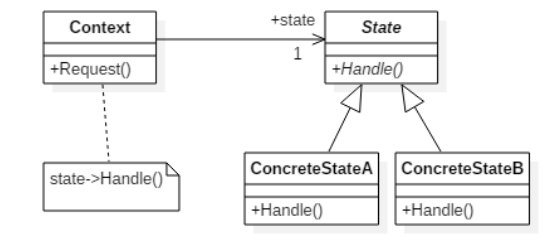

**Ejemplo Práctico:**
Se utiliza el patrón State para que los objetos *Ente* y *Puerta* tengan un comportamiento distinto en función de los estado indicados en el diagrama, por ejempla con la puerta cerrada no se puede entrar y el ente muerto no puede atacar

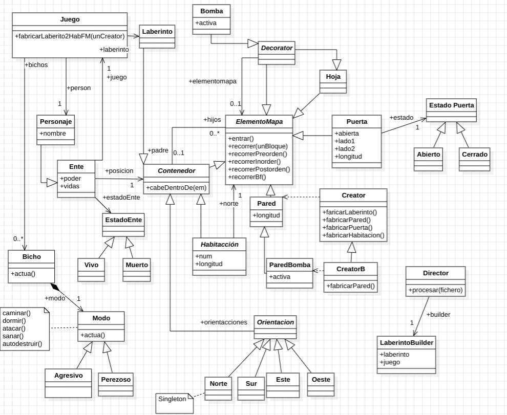

---

## 🛠️ Instalación y Uso

1. **Clonar el repositorio:**
   ```bash
   git clone [https://github.com/faresuclm/design-patterns.git](https://github.com/faresuclm/design-patterns.git)
   cd design-patterns
